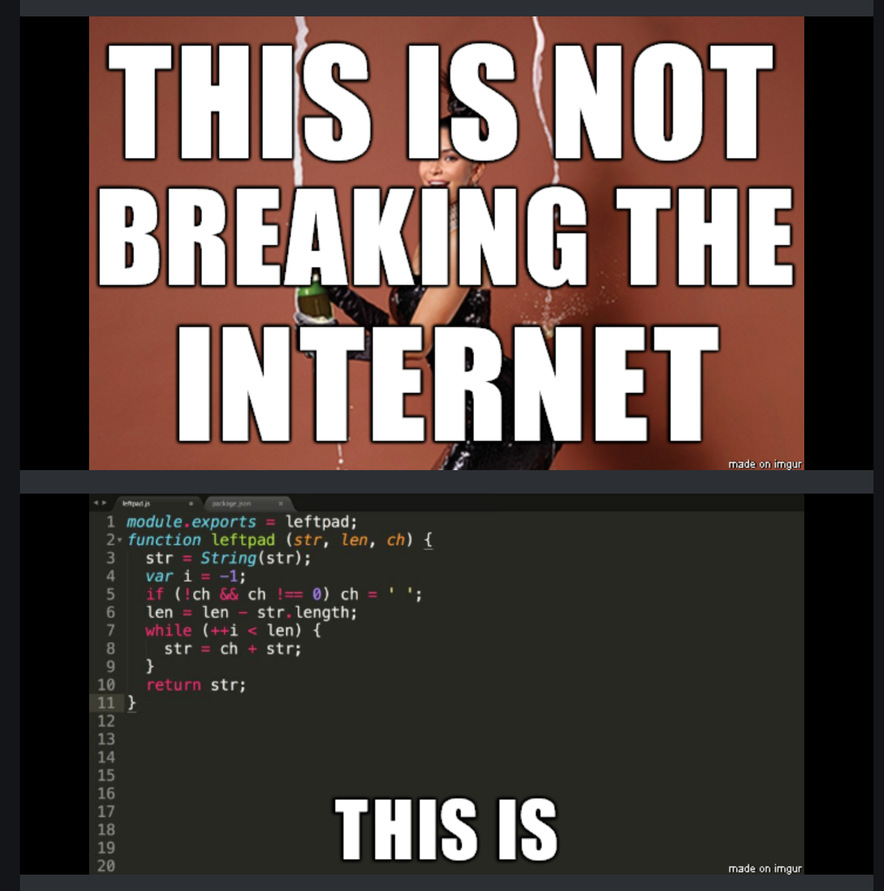
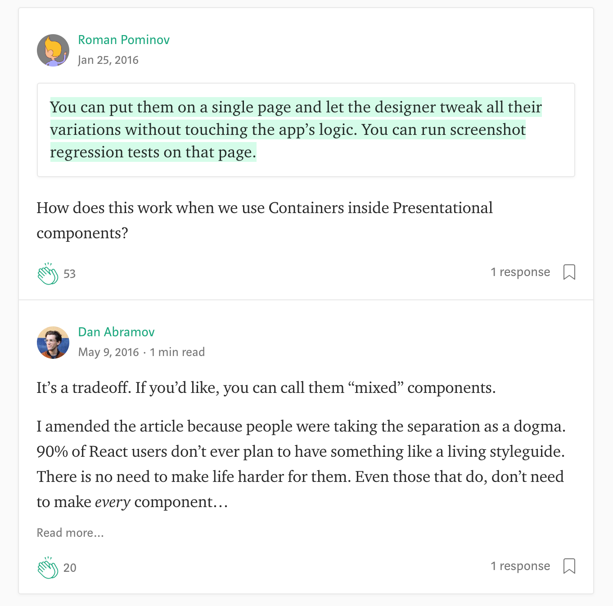
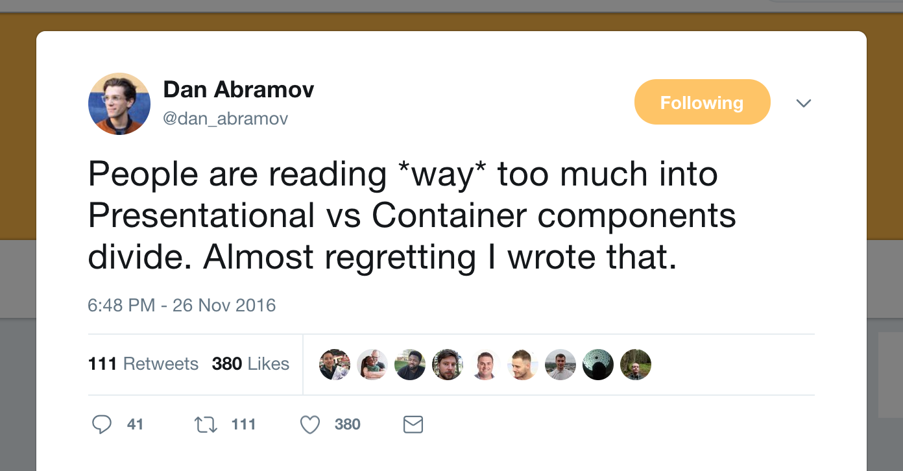

## Pratiquons React


Excilys - Zacaria Chtatar - Janvier 2018

https://github.com/Zacaria/practice-react

----

Votre collègue UI/UX vous donne un mockup à implémenter en React.

Le grand patron viendra le valider ce soir.

Screen / mockup

Note: Il s'en va, sans savoir que vous venez d'arriver. Et que vous ne connaissez pas React. Pour l'instant...

---

## Objectif de la journée

>> Implémenter des designs et des interactions avec ReactJs

---

## Sommaire

* Mettre en place le projet
* Créer une structure de projet
* Utiliser l'API de React

ou

* L'écosystème <!-- .element: class="fragment" data-fragment-index="1" -->
* Les outils et leur rôle <!-- .element: class="fragment" data-fragment-index="2" -->
* Scripts npm <!-- .element: class="fragment" data-fragment-index="3" -->
* Les composants <!-- .element: class="fragment" data-fragment-index="4" -->
* Le JSX <!-- .element: class="fragment" data-fragment-index="5" -->
* Sous le capot de React <!-- .element: class="fragment" data-fragment-index="6" -->
* Cycle de vie <!-- .element: class="fragment" data-fragment-index="7" -->
* Design patterns <!-- .element: class="fragment" data-fragment-index="8" -->

---

## L'écosystème

image de bordel

----

Comment choisir et installer ses dépendances ?

* Stars <!-- .element: class="fragment" data-fragment-index="1" -->
* Issues <!-- .element: class="fragment" data-fragment-index="2" -->
* Recherche de mots clés comme "deprecate" <!-- .element: class="fragment" data-fragment-index="3" -->
* Nombres de dépendances <!-- .element: class="fragment" data-fragment-index="4" -->
* Principales dépendances dépréciées ? <!-- .element: class="fragment" data-fragment-index="5" -->

----

NPM permet de ne pas réinventer la roue.

Oui mais en 2016 <!-- .element: class="fragment" data-fragment-index="1" -->

 <!-- .element: class="fragment" data-fragment-index="2" -->

[Source](https://qz.com/646467/how-one-programmer-broke-the-internet-by-deleting-a-tiny-piece-of-code/) <!-- .element: class="fragment" data-fragment-index="2" -->

----

Une autre pour la route

Babel et Guy Fieri <!-- .element: class="fragment" data-fragment-index="1" -->

[Source](https://medium.com/friendship-dot-js/i-peeked-into-my-node-modules-directory-and-you-wont-believe-what-happened-next-b89f63d21558) <!-- .element: class="fragment" data-fragment-index="2" -->

---

## DIY 0

Les DIY sont là pour vous faire pratiquer.

Vous allez donc aussi pratiquer les phases de recherche sur google :D

Liens utiles :

- [Doc](https://reactjs.org)
- [React Sandbox](https://codesandbox.io/)
- [JS Sandbox](https://babeljs.io/repl/)
- [Un article](https://medium.freecodecamp.org/react-aha-moments-4b92bd36cc4e)
- [Autres resources ici](https://github.com/Zacaria/learn-react)

---

## Les outils et leur rôle

Meme JS fatigue

----

## [NPM]() & [Yarn]()

----

## [Babel]()

react-jsx-transform

----

## [Eslint]()

Utilité

commande pour installer

screen config

----

## [Prettier]()

----

## [Webpack]()

- webpack-dev-server

----

## [Jest]()

----

## [create-react-app]()

Basic and robust setup

----

## [react-scripts]()

Executable scripts as dependency

---

## DIY 1

- Create a repo and init a create-react-app project
- Add Eslint
- Add Prettier

---

## Scripts npm

screen des scripts dans CRA

----

Les executables dans node_modules/.bin/ sont dans l'environnement des scripts

Exemple : screen react-scripts dans .bin

----

### Conclusion

webpack-dev-server + npm scripts <!-- .element: class="fragment" data-fragment-index="1" -->

= <!-- .element: class="fragment" data-fragment-index="2" -->

 ~~gulp~~ <!-- .element: class="fragment" data-fragment-index="3" -->

----~

## DIY 2

- Add lint script

---

## Les composants

>> Un composant est une brique de l'interface utilisateur.

Screen de site découpé en composants

----

Screen de site découpé en composants

A coté de 

Architecture correspondante

---

## Les natures de composants

- (Page)
- Components
- Containers

----

## Components

... ou dumbs, ou de présentation <!-- .element: class="fragment" data-fragment-index="1" -->

- S'occupe de **l'apparence** de l'interface utilisateur.
- Utilise souvent du HTML et du style.
- Ne spécifie ni les données, ni les comportements.
- N'est pas dépendant des briques logiques de l'application.

----

## Containers

... ou smarts, ou de comportement <!-- .element: class="fragment" data-fragment-index="1" -->

- S'occupe du **fonctionnement** de l'interface utilisateur.
- Utilise rarement du HTML et jamais de style.
- Spécifie les données et les comportements pour les Components.

----

Warniingemoji Ne vous prenez pas trop la tête warningemoji



[Components vs Containers](https://medium.com/@dan_abramov/smart-and-dumb-components-7ca2f9a7c7d0)

----



----

Quelques mots clés :

- components vs containers
- smart vs dumb components

---

## DIY 3

- Create folders
- Create components files

----

Architecture proposée

Utiliser un code couleur avec trois teintes :

- vert : component
- rouge : container
- bleu : page

---

## Les paramètres des composants

Si on considère un composant comme étant un objet Java

- état = attribut privé sans setter ni getter
- propriété = 
  - argument immutable 
  - passé à l'objet pour un rendu donné 
  - par la classe qui l'instancie
- cycle de vie = méthodes telles que les onCreate et onDestroy en Android

----

Exemple : Pastille de chat en bas à droite

Gif ou suite d'images (t0, t+n) du cycle de vie avec
  - componentDidMount : 10 sec timeout => appel API
  - Nouveau message par les props
  - Messages > 0 : changement du state pour ouverture

Note: Montrer le Gif : demander des idées à propos de ce qu'il s'est passé

----

Les propriétés sont passées par un composant parent.

Les propTypes indiquent **sans contraindre** le type de la propriété attendue.

Les defaultProps donnent une valeur par défaut à une propriété manquante.

---

## DIY 4

- Définir les composants avec états
- Définir les transmissions de propriétés

----

Data flow proposé

---

## Le cycle de vie

Refaire le schéma du cycle de vie

----

Exemple

```
class Clock extends React.Component {
  
  // Minimal component function, must at least return null
  render() { return null; }
}
```

----

Exemples :

- Différence entre PureComponent et Component : PureComponent implémente déjà shouldComponentUpdate

----

A retenir :

- render : obligatoire <!-- .element: class="fragment" data-fragment-index="1" -->
- setState : déclenche le cycle de vie du composant <!-- .element: class="fragment" data-fragment-index="2" -->
- componentDidMount : idéal pour les appels async <!-- .element: class="fragment" data-fragment-index="3" -->
- shouldComponentUpdate : performance tuning <!-- .element: class="fragment" data-fragment-index="4" -->

---

## DIY 5

Sans faire le JSX, choisir et créer un composant

- Un composant statefull : 
  - Faire une classe
  - Créer les hooks utiles
  - Le state initial
  - Les fonctions d'update du state
  - Destructurer les propriétés attendues dans le render
  - Les propTypes
- Un composant stateless : 
  - Faire une arrow-function
  - Déstructurer les propriétés attendues
  - Les propTypes.

---

## Le JSX

Fondamentalement, le JSX n'est qu'un syntaxe syntaxe simplifiée de la fonction `React.createElement(component, props, ...children)`.
Ce code :
```
<MyButton color="blue" shadowSize={2}>
  Click Me
</MyButton>
```

Se compile vers :
```
React.createElement(
  MyButton,
  {color: 'blue', shadowSize: 2},
  'Click Me'
)
```

----

A retenir :

- Nom des composants en majuscule
- Attributs HTML sont repris avec quelques exceptions
- `children` est la prop qui reçoit ce qu'il y entre les balises

Copié sans vergogne depuis [la doc](https://reactjs.org/docs/jsx-in-depth.html) <!-- .element: class="fragment" data-fragment-index="1" -->

---

## DIY 6

- Créer le JSX pour un composant dumb : tester avec des defaultProps)
- Créer le JSX pour un composant smart : tester avec du HTML)
- Brancher un smart et un dumb
- Terminer le mockup

---

## Performance

----

## DOM virtuel

Le rendu est pour le navigateur l'opération la plus couteuse


----

## Réconciliations

Lorsque render est executé, tous les enfant sont aussi emmenés dans un cycle de re-render.

Utiliser shouldComponentUpdate sur les enfants qui ne sont pas concernés permet d'éviter ce phénomène. <!-- .element: class="fragment" data-fragment-index="1" -->

----

## Mode production

`NODE_ENV = production`

- désactive les propTypes
- désactive les warnings
- minifie le build

Ce n'est qu'à ce moment qu'on a les performances attendues.

---

## Debug

screen détaillé de l'UI de React dev tools

---

## A ne pas faire !

- extend autre chose que Component ou PureComponent
